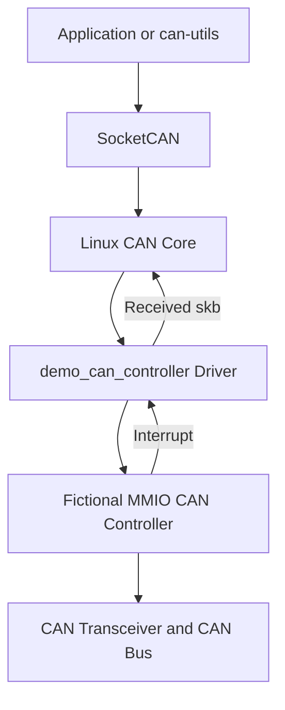

# Educational MMIO Classical CAN Controller Driver

`demo_can_controller.c` is an educational Linux kernel driver for a fictional memory-mapped I/O (MMIO) Classical CAN controller.

The driver demonstrates how a CAN controller can be integrated with:

* The Linux platform driver framework
* Device Tree matching
* MMIO register access
* Clock and interrupt resources
* The Linux CAN subsystem
* SocketCAN network interfaces
* CAN bit-timing configuration
* CAN frame transmission and reception
* Loopback and listen-only modes
* Bus-off detection and recovery

After the driver is successfully registered, Linux exposes the controller as a CAN network interface such as `can0`. Applications can then access it through standard SocketCAN tools and APIs instead of directly reading or writing hardware registers.

> **Important:** The controller, register layout, and Device Tree compatible string used by this driver are fictional. This code is intended for study only and must not be used with real hardware or in a production system.

---

## 1. Learning Goals

This driver helps beginners understand how a Linux CAN controller driver connects several kernel subsystems:



After studying the code, you should understand:

1. Why Linux represents a CAN controller as a network device.
2. How a platform driver receives MMIO, clock, and IRQ resources.
3. How CAN bit timing is calculated and programmed.
4. How a SocketCAN packet becomes a hardware transmission.
5. How an interrupt becomes a received SocketCAN frame.
6. Why CAN drivers use the echo skb mechanism.
7. How Linux handles the CAN bus-off state.

---

## 2. Driver Scope

The example supports basic Classical CAN operations:

* Standard SocketCAN network-device registration
* Classical CAN frames with up to 8 payload bytes
* One hardware transmit buffer
* Basic receive-buffer handling
* Configurable CAN bit timing
* Internal loopback mode
* Listen-only mode
* TX-complete interrupts
* RX interrupts
* Bus-off interrupts
* CAN Core restart through `CAN_MODE_START`

The example does not fully implement:

* CAN FD
* NAPI
* Multiple TX or RX mailboxes
* Detailed CAN error frames
* Hardware timestamps
* Runtime power management
* Suspend and resume
* Reset-controller handling
* Transceiver power or standby control
* RX overflow recovery
* TX timeout recovery
* Complete error-counter reporting

---

## 3. Linux CAN Software Stack

Linux uses SocketCAN to present CAN controllers as network interfaces.

A userspace application does not normally access the controller registers directly. Instead, it opens a CAN socket and sends or receives CAN frames through the Linux networking stack.

The transmit path is:

```text
cansend or SocketCAN application
    -> SocketCAN
    -> Linux CAN Core
    -> ndo_start_xmit()
    -> Driver writes TX registers
    -> Controller transmits the frame
    -> TX-complete interrupt
```

The receive path is:

```text
CAN frame arrives
    -> Controller stores the frame
    -> RX interrupt
    -> Driver reads RX registers
    -> Driver allocates a CAN skb
    -> netif_rx()
    -> SocketCAN
    -> candump or another application
```

This architecture separates hardware-specific operations from the application protocol.

Applications can use the same SocketCAN API even when the underlying CAN controller changes.

---

## 4. Fictional Register Map

The driver assumes that the controller is accessed through MMIO registers.

| Offset | Register              | Purpose                                          |
| -----: | --------------------- | ------------------------------------------------ |
| `0x00` | `DEMO_CAN_CTRL`       | Enable the controller and select operating modes |
| `0x04` | `DEMO_CAN_BITTIMING`  | Configure BRP, TSEG1, TSEG2, and SJW             |
| `0x08` | `DEMO_CAN_INT_STATUS` | Report pending interrupts                        |
| `0x0c` | `DEMO_CAN_INT_ENABLE` | Enable or disable interrupts                     |
| `0x10` | `DEMO_CAN_TX_ID`      | CAN identifier for transmission                  |
| `0x14` | `DEMO_CAN_TX_DLC`     | Transmit payload length                          |
| `0x18` | `DEMO_CAN_TX_DATA0`   | Beginning of transmit payload registers          |
| `0x20` | `DEMO_CAN_TX_COMMAND` | Start a transmission                             |
| `0x30` | `DEMO_CAN_RX_ID`      | Identifier of the received frame                 |
| `0x34` | `DEMO_CAN_RX_DLC`     | Received Data Length Code                        |
| `0x38` | `DEMO_CAN_RX_DATA0`   | Beginning of receive payload registers           |
| `0x40` | `DEMO_CAN_RX_RELEASE` | Release the current receive buffer               |

### Control bits

The control register contains three fictional control bits:

| Bit | Definition               | Meaning                   |
| --: | ------------------------ | ------------------------- |
|   0 | `DEMO_CAN_CTRL_ENABLE`   | Enable the CAN controller |
|   1 | `DEMO_CAN_CTRL_LOOPBACK` | Enable internal loopback  |
|   2 | `DEMO_CAN_CTRL_LISTEN`   | Enable listen-only mode   |

### Interrupt bits

The interrupt status and enable registers use the following bits:

| Bit | Definition             | Meaning                        |
| --: | ---------------------- | ------------------------------ |
|   0 | `DEMO_CAN_INT_RX`      | A CAN frame was received       |
|   1 | `DEMO_CAN_INT_TX`      | A CAN frame was transmitted    |
|   2 | `DEMO_CAN_INT_BUS_OFF` | The controller entered bus-off |

The example assumes that the interrupt-status register uses write-one-to-clear semantics. The driver clears an interrupt by writing the active status bits back to the register.

Real hardware may use a different interrupt-clearing method.

---

## 5. Driver Private Data

The driver stores its per-device information in `struct demo_can_priv`:

```c
struct demo_can_priv {
    struct can_priv can;
    void __iomem *base;
    struct clk *clk;
    struct net_device *ndev;
};
```

### `struct can_priv can`

`struct can_priv` is provided by the Linux CAN subsystem. It contains information such as:

* Current CAN state
* Controller clock frequency
* Calculated bit timing
* Supported controller modes
* Bit-timing callback
* Restart callback

It is normally placed first in the private structure used by a CAN controller driver.

### `void __iomem *base`

`base` points to the mapped controller-register area.

The physical MMIO address comes from Device Tree. The driver maps it into the kernel virtual address space with:

```c
devm_platform_ioremap_resource()
```

The driver then accesses registers through:

```c
readl()
writel()
```

### `struct clk *clk`

The clock is used to determine the time-quanta frequency from which the CAN bitrate is generated.

An incorrect controller clock produces an incorrect CAN bitrate even if userspace requests the correct bitrate.

### `struct net_device *ndev`

This is the Linux network-device object representing the controller.

After registration, it may appear as:

```text
can0
```

The interface number is assigned at runtime and should not be treated as a permanent physical identity.

---

## 6. CAN Bit-Timing Constraints

The driver describes its supported timing ranges with `struct can_bittiming_const`:

```c
static const struct can_bittiming_const demo_can_bittiming_const = {
    .name = "demo_can",
    .tseg1_min = 2,
    .tseg1_max = 16,
    .tseg2_min = 1,
    .tseg2_max = 8,
    .sjw_max = 4,
    .brp_min = 1,
    .brp_max = 1024,
    .brp_inc = 1,
};
```

A CAN bit is divided into timing segments:

```text
Bit time = Sync Segment + TSEG1 + TSEG2
```

The important parameters are:

| Parameter | Purpose                                           |
| --------- | ------------------------------------------------- |
| BRP       | Divides the controller input clock                |
| TSEG1     | Contains the propagation and first phase segments |
| TSEG2     | Contains the second phase segment                 |
| SJW       | Limits synchronization adjustment                 |

When userspace requests a bitrate:

```sh
sudo ip link set can0 type can bitrate 500000
```

the Linux CAN Core uses:

* The controller clock
* The timing constraints
* The requested bitrate

to calculate valid values for BRP, TSEG1, TSEG2, and SJW.

The driver programs the calculated values in `demo_can_set_bittiming()`.

The register layout in that function is fictional. Real controllers often use different registers and field widths.

---

## 7. Writing and Reading Payload Data

The fictional controller exposes its payload through 32-bit registers, but Classical CAN payloads are byte arrays.

The driver therefore copies up to four bytes during each MMIO operation.

### Writing payload data

`demo_can_write_data()` performs the following operation:

```text
CAN payload bytes
    -> copy up to 4 bytes into a u32
    -> writel()
    -> continue with the next register
```

For example, a six-byte payload:

```text
11 22 33 44 55 66
```

is written as two groups:

```text
First register:  11 22 33 44
Second register: 55 66 00 00
```

### Reading payload data

`demo_can_read_data()` performs the reverse operation:

```text
readl()
    -> obtain one 32-bit register
    -> copy the required bytes into cf->data
```

The final operation may copy fewer than four bytes.

This simple approach assumes that the CPU byte order matches the fictional register layout. A production driver must follow the exact byte-order definition in the hardware specification.

---

## 8. Opening the CAN Interface

When userspace runs:

```sh
sudo ip link set can0 up
```

the networking core calls:

```c
demo_can_open()
```

The function performs these steps:

1. Call `open_candev()` to initialize and validate the CAN device.
2. Program the calculated bit timing.
3. Add loopback or listen-only control bits when requested.
4. Enable RX, TX, and bus-off interrupts.
5. Enable the controller.
6. Set the CAN state to `CAN_STATE_ERROR_ACTIVE`.
7. Start the network transmit queue.

The interface becomes ready for transmission only after `netif_start_queue()` is called.

If bit-timing configuration fails, the driver calls `close_candev()` before returning the error.

---

## 9. Transmitting a CAN Frame

The network core calls:

```c
demo_can_start_xmit()
```

when a SocketCAN application sends a frame.

The function first obtains the Classical CAN frame from the socket buffer:

```c
struct can_frame *cf = (struct can_frame *)skb->data;
```

A simplified `struct can_frame` contains:

```c
canid_t can_id;
u8 len;
u8 data[8];
```

### Transmission sequence

The driver performs the following steps:

1. Validate the socket buffer.
2. Stop the network queue.
3. Store the skb in CAN echo slot 0.
4. Write the CAN identifier.
5. Write the payload length.
6. Write the payload bytes.
7. Write the transmit command.

The queue is stopped because the fictional controller has only one transmit buffer:

```c
netif_stop_queue(ndev);
```

Without this operation, the networking stack could provide another frame before the current frame has completed.

### Echo skb

The driver calls:

```c
can_put_echo_skb(skb, ndev, 0, 0);
```

This transfers management of the skb to the CAN echo mechanism.

The echo mechanism is used to:

* Track a frame that is currently being transmitted
* Release the skb after transmission completes
* Support local SocketCAN echo
* Account for the number of transmitted bytes

The driver allocates one echo slot:

```c
alloc_candev(sizeof(*priv), 1);
```

Therefore only one frame can be pending at a time.

Writing the transmit command means that the frame has been handed to the controller. It does not mean that the frame has already appeared successfully on the CAN bus.

Completion is reported later through the TX interrupt.

---

## 10. Handling TX Completion

When the controller finishes a transmission, it raises `DEMO_CAN_INT_TX`.

The interrupt handler completes the stored echo skb:

```c
unsigned int bytes = can_get_echo_skb(ndev, 0, NULL);
```

It then updates the network statistics:

```c
ndev->stats.tx_packets++;
ndev->stats.tx_bytes += bytes;
```

Finally, it wakes the transmit queue:

```c
netif_wake_queue(ndev);
```

The networking stack can now submit the next frame.

The complete lifecycle is:

```text
SocketCAN creates skb
    -> ndo_start_xmit()
    -> can_put_echo_skb()
    -> controller transmits
    -> TX interrupt
    -> can_get_echo_skb()
    -> wake transmit queue
```

---

## 11. Receiving a CAN Frame

The interrupt handler calls `demo_can_receive()` when `DEMO_CAN_INT_RX` is set.

The function first allocates a CAN socket buffer:

```c
skb = alloc_can_skb(ndev, &cf);
```

If allocation fails, the driver:

1. Increments `rx_dropped`.
2. Releases the hardware receive buffer.
3. Returns without delivering a frame.

Releasing the hardware buffer is important even when allocation fails. Otherwise, the controller could remain blocked by the unread frame.

### Receive sequence

For a valid allocation, the function:

1. Reads the CAN identifier.
2. Reads the DLC.
3. Converts the Classical CAN DLC to a data length.
4. Reads the payload.
5. Releases the hardware receive buffer.
6. Updates receive statistics.
7. Passes the skb to the networking stack.

The frame is delivered with:

```c
netif_rx(skb);
```

SocketCAN can then provide it to programs such as `candump`.

The example assumes that the value in `DEMO_CAN_RX_ID` already uses the Linux `can_id` representation. Real controllers usually require explicit conversion of:

* Standard identifiers
* Extended identifiers
* Remote-frame flags
* Error flags

---

## 12. Interrupt Handling

The driver uses one interrupt handler:

```c
demo_can_irq()
```

It reads the interrupt status:

```c
u32 status = readl(priv->base + DEMO_CAN_INT_STATUS);
```

If none of the supported interrupt bits are active, it returns:

```c
IRQ_NONE
```

Otherwise, it clears the active interrupts and handles each condition.

### RX interrupt

```text
RX interrupt
    -> allocate CAN skb
    -> read identifier, DLC, and data
    -> release hardware buffer
    -> call netif_rx()
```

### TX interrupt

```text
TX interrupt
    -> complete echo skb
    -> update TX statistics
    -> wake network queue
```

### Bus-off interrupt

```text
Bus-off interrupt
    -> set CAN_STATE_BUS_OFF
    -> call can_bus_off()
```

The `(void)irq` statement prevents an unused-parameter warning because the handler does not need the IRQ number.

---

## 13. Bus-Off Handling

CAN controllers maintain transmit and receive error counters.

After severe repeated errors, a transmitting node can enter the bus-off state and logically disconnect itself from normal bus activity.

Typical causes include:

* Incorrect bitrate
* Missing termination
* No other active node to provide ACK
* Reversed CAN_H and CAN_L wiring
* Disabled or unpowered transceiver
* Incorrect sample point
* Excessive electrical noise

The driver handles bus-off with:

```c
priv->can.state = CAN_STATE_BUS_OFF;
can_bus_off(ndev);
```

`can_bus_off()` informs the Linux CAN Core and stops normal transmission.

Userspace may configure automatic restart:

```sh
sudo ip link set can0 type can restart-ms 1000
```

The CAN Core can later call:

```c
demo_can_set_mode(ndev, CAN_MODE_START);
```

to restart the controller.

Automatic restart should not replace hardware diagnosis. Repeated bus-off events normally indicate a wiring, timing, transceiver, or network problem.

---

## 14. Loopback and Listen-Only Modes

The driver supports two optional controller modes.

### Loopback

Loopback sends transmitted frames back into the controller internally.

It is useful for basic software and controller testing without a complete physical CAN network.

The driver maps:

```c
CAN_CTRLMODE_LOOPBACK
```

to:

```c
DEMO_CAN_CTRL_LOOPBACK
```

### Listen-only

Listen-only mode allows the controller to observe traffic without participating normally in the bus.

The driver maps:

```c
CAN_CTRLMODE_LISTENONLY
```

to:

```c
DEMO_CAN_CTRL_LISTEN
```

The exact electrical behavior depends on the real controller. Some controllers in listen-only mode do not transmit ACK bits or error flags.

---

## 15. Stopping the CAN Interface

When userspace runs:

```sh
sudo ip link set can0 down
```

the networking core calls:

```c
demo_can_stop()
```

The function:

1. Stops the transmit queue.
2. Disables controller interrupts.
3. Disables the controller.
4. Changes the CAN state to `CAN_STATE_STOPPED`.
5. Calls `close_candev()`.

Stopping the queue before disabling the controller prevents new frames from being submitted during shutdown.

---

## 16. Network Device Operations

The driver connects Linux network operations to its callbacks:

```c
static const struct net_device_ops demo_can_netdev_ops = {
    .ndo_open = demo_can_open,
    .ndo_stop = demo_can_stop,
    .ndo_start_xmit = demo_can_start_xmit,
    .ndo_change_mtu = can_change_mtu,
};
```

| Userspace operation     | Driver callback         |
| ----------------------- | ----------------------- |
| `ip link set can0 up`   | `demo_can_open()`       |
| `ip link set can0 down` | `demo_can_stop()`       |
| Send a SocketCAN frame  | `demo_can_start_xmit()` |
| Change the CAN MTU      | `can_change_mtu()`      |

This driver is intended for Classical CAN and does not configure CAN FD support.

---

## 17. Platform Driver Probe

`demo_can_probe()` is called after the platform bus matches the driver with a Device Tree node.

The probe sequence is:

```text
Allocate CAN netdevice
    -> map MMIO registers
    -> get and enable clock
    -> get IRQ
    -> configure can_priv
    -> configure net_device
    -> request IRQ
    -> register CAN device
```

### Allocate the CAN device

```c
ndev = alloc_candev(sizeof(*priv), 1);
```

This allocates:

* A CAN network device
* The driver-private structure
* One CAN echo slot

### Map the MMIO resource

```c
priv->base = devm_platform_ioremap_resource(pdev, 0);
```

This obtains and maps the first Device Tree `reg` resource.

### Get the clock

```c
priv->clk = devm_clk_get_enabled(&pdev->dev, NULL);
```

The function obtains and enables the controller clock.

The actual rate is passed to the CAN Core:

```c
priv->can.clock.freq = clk_get_rate(priv->clk);
```

### Get the interrupt

```c
irq = platform_get_irq(pdev, 0);
```

This obtains the first interrupt resource assigned to the device.

### Configure the CAN Core

The probe function provides:

* Bit-timing limits
* A bit-timing callback
* A controller-start callback
* Supported controller modes
* Initial CAN state

The supported mode declaration is:

```c
CAN_CTRLMODE_LOOPBACK |
CAN_CTRLMODE_LISTENONLY |
CAN_CTRLMODE_BERR_REPORTING
```

However, this educational driver does not generate detailed SocketCAN error frames. Therefore, its bus-error-reporting support is incomplete.

### Register the IRQ and CAN device

The interrupt is registered with:

```c
devm_request_irq()
```

The CAN network device is registered with:

```c
register_candev()
```

After successful registration, Linux can expose the device as `can0`, `can1`, or another runtime-assigned interface name.

---

## 18. Device Tree Matching

The driver uses this fictional compatible string:

```c
{ .compatible = "demo,mmio-can" }
```

A conceptual Device Tree node could look like:

```dts
can@10000000 {
    compatible = "demo,mmio-can";
    reg = <0x10000000 0x1000>;
    interrupts = <...>;
    clocks = <&can_clock>;
    status = "okay";
};
```

This fragment is only an illustration.

The exact formats of `reg`, `interrupts`, and `clocks` depend on:

* The target SoC
* The interrupt controller
* Parent address-cell definitions
* The clock controller
* The real CAN controller binding

Do not copy the example into production Device Tree files.

`MODULE_DEVICE_TABLE()` exports the Device Tree matching information as module aliases, allowing Linux module-loading tools to associate the driver with matching devices.

---

## 19. Driver Removal

When the platform device is removed, `demo_can_remove()` performs:

```c
unregister_candev(ndev);
free_candev(ndev);
```

`unregister_candev()` removes the SocketCAN interface.

`free_candev()` releases the network-device allocation.

Resources acquired through device-managed APIs, including MMIO mapping, clock enablement, and IRQ registration, are automatically released when the device is removed.

---

## 20. Building the Module

A minimal out-of-tree Makefile may contain:

```makefile
obj-m += demo_can_controller.o

KDIR ?= /lib/modules/$(shell uname -r)/build

all:
	$(MAKE) -C $(KDIR) M=$(PWD) modules

clean:
	$(MAKE) -C $(KDIR) M=$(PWD) clean
```

Build the module with:

```sh
make
```

The module must be built against kernel headers that match the target kernel.

Check the running kernel version:

```sh
uname -r
```

Load the module:

```sh
sudo insmod demo_can_controller.ko
```

Inspect kernel messages:

```sh
dmesg | tail -n 50
```

Unload it with:

```sh
sudo rmmod demo_can_controller
```

The module will only bind successfully when the platform contains a matching fictional Device Tree node and a hardware model implementing the expected register layout.

---

## 21. SocketCAN Test Commands

These commands require a correctly instantiated controller or compatible hardware model.

### Inspect CAN interfaces

```sh
ip -details link show type can
```

### Configure a bitrate

```sh
sudo ip link set can0 type can bitrate 500000
```

### Enable the interface

```sh
sudo ip link set can0 up
```

### Monitor frames

```sh
candump -e -x can0
```

### Send a Classical CAN frame

From another terminal:

```sh
cansend can0 123#11223344
```

This sends:

* Standard CAN ID: `0x123`
* Payload: `11 22 33 44`

### Stop the interface

```sh
sudo ip link set can0 down
```

### Configure loopback mode

```sh
sudo ip link set can0 down
sudo ip link set can0 type can bitrate 500000 loopback on
sudo ip link set can0 up
```

The fictional controller must implement the loopback bit for this test to work.

---

## 22. Testing Without CAN Hardware

This driver cannot use `vcan0` as its hardware backend. `vcan` is a separate virtual CAN network driver.

However, beginners can use `vcan` to learn SocketCAN safely:

```sh
sudo modprobe vcan
sudo ip link add dev vcan0 type vcan
sudo ip link set vcan0 up
```

Monitor the virtual interface:

```sh
candump vcan0
```

Send a frame from another terminal:

```sh
cansend vcan0 123#11223344
```

Remove the virtual interface after testing:

```sh
sudo ip link delete vcan0
```

`vcan` verifies SocketCAN application behavior, but it does not test:

* MMIO access
* Controller interrupts
* Bit timing
* CAN transceivers
* Bus termination
* Physical wiring
* Error confinement
* Bus-off recovery

---

## 23. Debugging Suggestions

### Confirm that the driver loaded

```sh
lsmod | grep demo_can
dmesg | grep -i can
```

### Confirm Device Tree matching

Check the platform device and bound driver:

```sh
find /sys/bus/platform/devices -maxdepth 2 -type l
```

A real system may also be inspected with:

```sh
readlink /sys/class/net/can0/device/driver
```

### Inspect the controller state

```sh
ip -details -statistics link show can0
```

Look for:

* Current bitrate
* Sample point
* CAN state
* TX and RX counters
* Dropped frames
* Bus errors
* Bus-off events

### Inspect interrupts

```sh
cat /proc/interrupts | grep -i can
```

If the interrupt count never changes, possible causes include:

* Incorrect Device Tree interrupt
* Controller interrupt not enabled
* Incorrect interrupt polarity or trigger type
* Controller clock disabled
* Hardware not receiving frames
* Incorrect register layout

### Investigate bus-off

Before restarting the interface, verify:

* All nodes use the same bitrate
* CAN_H and CAN_L are wired correctly
* The two physical bus ends have 120-ohm termination
* The transceiver is powered and enabled
* Another active node is available to send ACK
* Ground and common-mode voltage are valid

---

## 24. Important Educational Limitations

This driver intentionally simplifies many details.

### Fictional CAN-ID register format

The driver writes Linux `can_id` directly to the TX register:

```c
writel(cf->can_id, priv->base + DEMO_CAN_TX_ID);
```

A real controller normally separates:

* Identifier bits
* Standard or extended format
* Remote-frame indication
* Error status

A production driver must translate between the Linux representation and the hardware representation.

### Incomplete bus-error reporting

The driver declares:

```c
CAN_CTRLMODE_BERR_REPORTING
```

but only handles the bus-off condition.

A complete driver should report errors such as:

* ACK errors
* Bit errors
* Stuff errors
* CRC errors
* Form errors
* Error-warning
* Error-passive
* RX overflow

These are normally delivered through SocketCAN error frames.

### No NAPI

Received frames are passed to `netif_rx()` directly from the interrupt handler.

Production network drivers often use NAPI to limit interrupt load and process multiple received packets efficiently.

### Only one TX slot

The network queue is stopped for every frame because the example has one TX buffer and one echo slot.

A real controller may provide multiple mailboxes or a transmit FIFO.

### No CAN FD

Classical CAN supports up to 8 payload bytes.

CAN FD supports payloads up to 64 bytes and may use a faster data phase. Supporting CAN FD requires different frame structures, MTU handling, control modes, timing parameters, and hardware registers.

### No transceiver management

A real board may require:

* A regulator
* An enable GPIO
* A standby GPIO
* A CAN PHY
* A silent-mode GPIO

This driver does not manage those resources.

---

## 25. Source-Code Study Order

A beginner can read the driver in the following order:

1. Register definitions
   Understand what the fictional hardware exposes.

2. `struct demo_can_priv`
   Identify the state stored for each controller.

3. `demo_can_probe()`
   Follow resource acquisition and CAN-device registration.

4. `demo_can_open()`
   Learn what happens when `can0` is brought up.

5. `demo_can_set_bittiming()`
   Follow CAN Core timing values into hardware registers.

6. `demo_can_start_xmit()`
   Follow one outgoing SocketCAN frame.

7. `demo_can_irq()`
   Understand RX, TX-complete, and bus-off events.

8. `demo_can_receive()`
   Follow one incoming frame into SocketCAN.

9. `demo_can_stop()` and `demo_can_remove()`
   Review shutdown and cleanup.

---

## 26. Key Takeaways

This driver demonstrates the standard structure of a basic Linux CAN controller driver:

```text
platform_driver
    -> probe()
    -> alloc_candev()
    -> configure can_priv
    -> configure net_device_ops
    -> request IRQ
    -> register_candev()
```

The transmit path is:

```text
SocketCAN skb
    -> ndo_start_xmit()
    -> can_put_echo_skb()
    -> write TX registers
    -> TX interrupt
    -> can_get_echo_skb()
    -> wake the network queue
```

The receive path is:

```text
RX interrupt
    -> alloc_can_skb()
    -> read RX registers
    -> release hardware RX buffer
    -> netif_rx()
    -> SocketCAN application
```

The bus-off path is:

```text
Bus-off interrupt
    -> CAN_STATE_BUS_OFF
    -> can_bus_off()
    -> optional CAN Core restart
```

The most important idea is that the driver converts hardware-specific register operations into the standard Linux SocketCAN interface.

Applications therefore communicate through normal CAN sockets and do not need to understand the underlying controller registers.

---

## 27. Safety Notice

Do not use this driver on a production CAN network.

Before working with real CAN hardware:

* Use the upstream driver for the actual controller.
* Validate the Device Tree against the kernel binding.
* Verify the controller clock and CAN bitrate.
* Check the transceiver voltage and control pins.
* Confirm cable topology and termination.
* Coordinate CAN identifier ownership.
* Do not transmit arbitrary frames on power, motion, automotive, or safety-related networks.
* Record error counters and physical conditions before automatically restarting a bus-off controller.

A wrong bitrate, incorrect wiring, or unauthorized CAN frame can disrupt every node on the shared bus.

---

## License

The source code is licensed under:

```text
GPL-2.0-only
```

See the SPDX identifier at the beginning of `demo_can_controller.c`.
