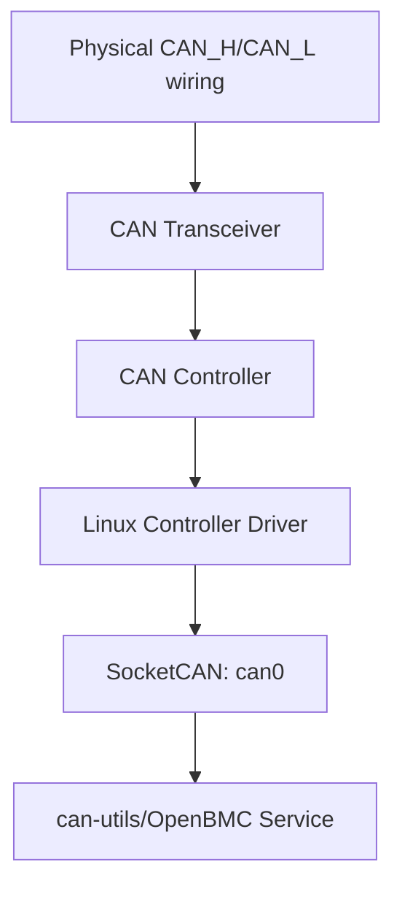
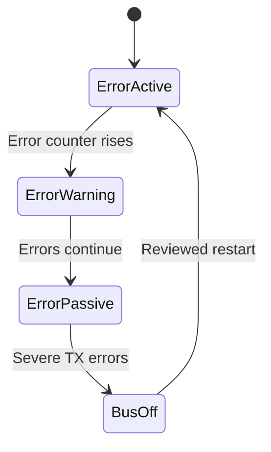

# CAN Debugging Guide
The most important principle of CAN debugging is:

> Start with the physical wiring and check each layer from the bottom up. Do not immediately suspect the application or driver.

CAN problems may occur in the resistors, wiring, transceiver, controller, Linux driver, SocketCAN, or application protocol. Without a layered inspection, it is easy to waste time investigating the wrong area.

---

## 1. Complete CAN Data Path



Debug in the following order:

1. Physical bus
2. CAN transceiver
3. CAN controller
4. Linux driver
5. SocketCAN
6. Application-layer protocol

For example, if `candump` receives no data, the problem is not necessarily in `candump`. Possible causes include:

- The CAN bus has no termination resistors.
- The transceiver is still in standby.
- The bitrate is configured incorrectly.
- The driver failed to obtain the IRQ.
- A SocketCAN filter discarded the frame.
- The application uses the wrong CAN ID.

---

# 2. Layered Workflow

## Layer 1: Verify the Physical Topology

First, check:

- Whether CAN_H and CAN_L are swapped.
- Whether each physical end of the bus has one 120 Ω termination resistor.
- Whether all nodes have an appropriate common ground.
- Whether each CAN transceiver has the correct power supply.
- Whether the standby, enable, and silent-mode pins are configured correctly.
- Whether the cable and connector pinout are correct.
- Whether any stub is excessively long.
- Whether a suitable twisted-pair cable is used.

A typical high-speed CAN bus should look like this:

```text
120 Ω                                      120 Ω
  │                                          │
Node A ───────── Node B ───────── Node C ────┘
                  │
               Short stub
```

Termination resistors should be installed only at the two physical ends of the bus, not at every node.

### Measuring Termination Resistance with Power Off

After powering off the system, use a multimeter to measure the resistance between CAN_H and CAN_L.

Two 120 Ω resistors in parallel give approximately:

```math
120\ \Omega \parallel 120\ \Omega = 60\ \Omega
```

Therefore, a normal bus typically measures about 60 Ω.

| Measurement | Possible condition |
| --- | --- |
| About 60 Ω | Both termination resistors are probably present |
| About 120 Ω | One termination resistor may be missing |
| About 40 Ω | Three 120 Ω resistors may be installed |
| Nearly infinite | Termination is missing or the wiring is open |
| Nearly 0 Ω | CAN_H and CAN_L may be shorted |

This is only a preliminary check; other circuits on the board may affect the measured value.

---

## Layer 2: Verify the Controller and Driver

Next, confirm that Linux has successfully detected the CAN controller.

Check:

- Whether the Device Tree is correct.
- Whether the driver or kernel module is loaded.
- Whether the MMIO or SPI controller probed successfully.
- Whether the clock is correct.
- Whether reset has been deasserted.
- Whether pinctrl routes the pins to CAN TX/RX.
- Whether the IRQ is correct.
- Whether transceiver binding succeeded.
- Whether a network interface such as `can0` was created.

Inspect CAN interfaces:

```sh
ip link show
```

Or display only CAN interfaces:

```sh
ip -details link show type can
```

Inspect the driver:

```sh
readlink /sys/class/net/can0/device/driver
```

Inspect the kernel log:

```sh
journalctl -k -b | grep -Ei 'can|mcp25|m_can|bus.off'
```

For an external SPI CAN controller such as the MCP2518FD, also inspect the SPI probe:

```sh
dmesg | grep -Ei 'spi|mcp25|can'
```

Inspect IRQs:

```sh
cat /proc/interrupts
```

The corresponding IRQ count should continue increasing while CAN frames are transmitted or received.

If the IRQ count never increases, possible causes include:

- An incorrect Device Tree IRQ number.
- Incorrect IRQ polarity or trigger type.
- Controller interrupts are not enabled.
- The SPI interrupt pin is not connected correctly.
- Incorrect pinctrl configuration.
- The hardware has not received any CAN frame.

---

## Layer 3: Verify Bit Timing

All nodes connected to the same CAN bus must use compatible settings.

Compare:

- Nominal bitrate.
- Data bitrate.
- Sample point.
- Classical CAN versus CAN FD.
- Whether BRS is enabled.
- Controller clock.
- Oscillator tolerance.

For example, to configure Classical CAN at 500 kbit/s:

```sh
sudo ip link set can0 type can bitrate 500000
sudo ip link set can0 up
```

Inspect the actual settings:

```sh
ip -details link show can0
```

The output may include:

```text
can state ERROR-ACTIVE
bitrate 500000
sample-point 0.875
```

CAN FD may require two bitrates:

```sh
sudo ip link set can0 type can \
    bitrate 500000 \
    dbitrate 2000000 \
    fd on
```

Where:

- `bitrate`: Speed of the arbitration/nominal phase.
- `dbitrate`: Speed of the CAN FD data phase.
- `fd on`: Enables CAN FD.

When BRS is used, the frame switches to the faster `dbitrate` during the data phase.

Even if two nodes are both configured for 500 kbit/s, errors may still occur if the following differ too much:

- Sample point.
- Clock frequency.
- Crystal accuracy.
- Bus length.
- Controller timing capability.

---

## Layer 4: Collect Software Evidence

Start by running:

```sh
ip -details -statistics link show can0
```

This can display:

- Whether the CAN interface is up.
- Bitrate.
- Sample point.
- Controller state.
- RX/TX packet counts.
- RX/TX errors.
- Dropped packets.
- Bus errors.
- Error-warning state.
- Error-passive state.
- Bus-off count.

Then run:

```sh
candump -e -x -ta can0
```

The options mean:

| Option | Function |
| --- | --- |
| `-e` | Decodes SocketCAN error frames |
| `-x` | Displays additional RX/TX and error information |
| `-ta` | Displays absolute timestamps |

For the kernel log, use:

```sh
journalctl -k -b | grep -Ei 'can|mcp25|m_can|bus.off'
```

Where:

- `-k`: Shows only kernel logs.
- `-b`: Shows only the current boot.
- `grep -E`: Searches for multiple patterns.
- `-i`: Ignores letter case.

If the project provides a script, you can also run:

```sh
scripts/debug_can.sh can0
```

Such scripts normally collect system state without actively transmitting CAN frames, making them suitable for obtaining a read-only snapshot on a production system.

---

## Layer 5: Observe CAN_H/CAN_L Waveforms

If software information is insufficient, use:

- A CAN protocol analyzer.
- An oscilloscope.
- A logic analyzer with a CAN decoder.

Verify:

- Whether CAN_H/CAN_L actually carry a signal.
- Whether dominant and recessive voltages are reasonable.
- Whether the bitrate is correct.
- Whether frames receive an ACK.
- Whether error frames appear continuously.
- Whether the signal has ringing or overshoot.
- Whether edges are too slow.
- Whether the ground offset is too large.

### Common Interpretations

| Observation | Possible cause |
| --- | --- |
| No waveform at all | The controller is not transmitting, the transceiver is in standby, or pinmux is wrong |
| Signal only on the TX pin | A transceiver or CAN-bus wiring problem |
| Frames are retransmitted continuously | No other node is acknowledging them |
| Severe waveform distortion or ringing | Termination, stub, cable, or impedance problem |
| Decoded bitrate is incorrect | Incorrect controller clock or bit timing |

A general-purpose logic analyzer may only observe the digital TX/RX signals between the controller and transceiver. CAN_H/CAN_L are differential analog signals and are normally better inspected with an oscilloscope or CAN-aware analyzer.

---

## Layer 6: Verify Application-Layer Data

Only after the physical layer and SocketCAN work correctly should you inspect the application layer.

Verify:

- Who defines each CAN ID.
- Whether a standard or extended ID is used.
- Whether the DLC and payload length are correct.
- Whether byte order is little-endian or big-endian.
- Value scaling.
- Offset.
- Sequence counter.
- Timeout.
- Message update period.
- Handling of duplicate or out-of-order messages.
- Authorization and security policy for control commands.

For example, temperature data may be defined as:

```text
CAN ID: 0x321
Bytes 0–1: Temperature
Format: Little-endian signed 16-bit
Scale: 0.1°C
```

If the received bytes are:

```text
FA 00
```

Little-endian interpretation gives:

```text
0x00FA = 250
```

Applying the scale gives:

```text
250 × 0.1°C = 25.0°C
```

If big-endian is used by mistake, the value becomes `0xFA00`, which is completely wrong.

Therefore, receiving a frame does not guarantee that its data is interpreted correctly.

---

# 3. Common Symptoms and Where to Look

| Symptom | Check first |
| --- | --- |
| `can0` is missing | DTS, driver, module, clock, reset, SPI probe |
| `can0` exists but is down | Configure the bitrate, then run `ip link set can0 up` |
| `NOARP` is shown | This is a normal CAN network-device flag, not an error |
| TX errors or no ACK | Only one node, bitrate mismatch, wiring error, silent mode |
| Error-passive | Bus errors have accumulated over time |
| Bus-off | Severe or persistent transmission errors |
| RX works but TX fails | Standby/silent pin, TX wiring, permissions, bus arbitration |
| Occasional CRC/stuff errors | Termination, stubs, EMI, ground, sample point |
| Socket receives no data | Interface down, filter, CAN ID flag, network namespace |
| Classical CAN works but CAN FD fails | FD capability, data bitrate, BRS, transceiver bandwidth |
| IRQ count does not increase | IRQ DTS, polarity, hardware signal, controller interrupt configuration |
| TX packet count increases but the peer receives nothing | Transceiver, wiring, bitrate, bus topology |

---

# 4. Why Is `NOARP` Not an Error?

Running:

```sh
ip link show can0
```

may show:

```text
<NOARP,ECHO>
```

Users may mistake `NOARP` for an error, but this is normal.

ARP is an Ethernet/IPv4 protocol that resolves IP addresses to MAC addresses. CAN frames have no Ethernet MAC addresses and do not use ARP, so a CAN network device normally displays `NOARP`.

What actually requires attention is:

```text
state DOWN
```

If the interface has no configured bitrate or has not been started, run:

```sh
sudo ip link set can0 type can bitrate 500000
sudo ip link set can0 up
```

---

# 5. What Does a Missing ACK Mean?

The ACK for a CAN frame is driven onto the physical bus by another receiving node.

Even if no userspace application on that node receives the CAN ID, the node will normally send an ACK as long as it validates the frame's CRC and format.

Therefore:

> Not running `candump` does not cause a missing ACK.

A missing ACK is more likely to mean:

- The bus has only one node in normal mode.
- Other nodes are unpowered.
- All other nodes are in listen-only mode.
- Bitrates do not match.
- CAN_H/CAN_L are wired incorrectly.
- The transceiver is not enabled.
- The path between the controller and bus is broken.
- The peer cannot decode the frame correctly.

When testing with only one node, use the controller's internal loopback mode. Do not expect a single normal-mode node to acknowledge itself on the physical bus.

---

# 6. CAN Error States

A CAN controller maintains:

- The Transmit Error Counter (TEC).
- The Receive Error Counter (REC).

As errors accumulate, the controller may move through these states:



## Error-active

The normal operating state. The node can transmit active error flags.

## Error-warning

An error counter has exceeded its warning threshold, indicating that the bus is becoming unstable.

## Error-passive

Errors are more severe. The node limits its error signaling to avoid excessively disrupting the bus.

## Bus-off

This normally occurs when the Transmit Error Counter reaches a severe threshold. The controller logically disconnects itself from the CAN bus and no longer transmits normally.

---

# 7. What Is a SocketCAN Error Frame?

A SocketCAN error frame is diagnostic information provided by Linux, such as:

- Bus-off.
- Controller warning.
- Error-passive state.
- ACK error.
- Bit error.
- Stuff error.
- CRC error.
- RX overflow.

Display and decode these frames with:

```sh
candump -e can0
```

Keep in mind:

> A SocketCAN error frame is not a normal data frame transmitted by another node over CAN_H/CAN_L.

It is normally a local diagnostic packet created by the CAN controller driver from the hardware error status and then delivered to SocketCAN.

Therefore, another CAN node does not directly receive your Linux SocketCAN error frames.

---

# 8. Correct Bus-off Handling

When bus-off occurs, do not restart immediately, because doing so may erase the original evidence.

Recommended procedure:

## 1. Record the State First

```sh
ip -details -statistics link show can0
```

Record:

- CAN state.
- Bitrate.
- Sample point.
- TX/RX errors.
- Bus-off count.
- Dropped frames.

## 2. Collect Error Frames

```sh
candump -e -x -ta can0
```

## 3. Stop Application Transmissions

Prevent control commands from being retransmitted continuously and adding further bus load.

## 4. Fix the Root Cause

Check:

- Bitrate.
- Sample point.
- Wiring.
- Termination.
- Transceiver power.
- Standby/silent mode.
- Whether a peer node exists.
- Whether the clock is correct.

## 5. Restart Manually

After fixing the problem, run:

```sh
sudo ip link set can0 type can restart
```

If the kernel or driver does not support this operation, bring the interface down and up:

```sh
sudo ip link set can0 down
sudo ip link set can0 up
```

---

## Automatic Restart

Configure automatic restart with:

```sh
sudo ip link set can0 type can restart-ms 1000
```

This waits 1000 ms after bus-off before attempting a restart.

Automatic restart is appropriate for a recovery policy that has been deliberately designed and validated, but it must not conceal faults indefinitely.

In an OpenBMC system, record:

- The bus-off count.
- The most recent occurrence time.
- Whether recovery succeeded.
- Which CAN interface failed.
- Whether a related FRU or device became unreachable.

Then report health status through D-Bus, the event log, or Redfish.

---

# 9. Why Does RX Work While TX Fails?

Working RX proves that the controller can at least receive the bus's electrical signals, but it does not prove that the TX path works.

Possible causes include:

- The transceiver is in silent mode.
- TX enable is not asserted.
- Incorrect standby-GPIO polarity.
- Incorrect pinmux for the controller TX pin.
- An open circuit on the transceiver TXD connection.
- Linux interface permission or policy restrictions.
- The application transmits the wrong CAN ID.
- A lower-priority frame repeatedly loses arbitration.
- The bus is nearly saturated.
- The controller is already error-passive or bus-off.

Measure these points together:

- Controller TX pin.
- Transceiver RX pin.
- CAN_H/CAN_L.

This helps identify the layer at which the signal disappears.

---

# 10. Why Do CRC or Stuff Errors Occur Occasionally?

Intermittent CRC, bit, or stuff errors are commonly caused by marginal signal quality or timing:

- Incorrect termination resistance.
- Excessively long stubs.
- Poor-quality cable.
- Intermittent connector contact.
- EMI.
- Ground offset.
- An unsuitable sample point.
- Oscillator error.
- An excessively fast CAN FD data phase.
- Insufficient transceiver bandwidth.

These problems usually cannot be diagnosed with `dmesg` alone. Use an oscilloscope to inspect:

- Edges.
- Ringing.
- Overshoot.
- Noise.
- Differential voltage.
- Signal stability around the sample point.

---

# 11. SocketCAN Receives No Data

If a hardware analyzer sees frames but the Linux application receives nothing, inspect the software layer.

## Is the Interface Up?

```sh
ip link show can0
```

Confirm that it shows:

```text
UP
LOWER_UP
```

## Is a Filter Applied?

A SocketCAN application may receive only selected IDs.

For example, if the socket accepts only `0x123`, other IDs are not delivered to it even though they appear on the bus.

## Standard ID Versus Extended ID

The same numeric CAN ID does not necessarily represent the same frame.

For example:

- Standard ID `0x123`.
- Extended ID `0x00000123`.

These have different flags in SocketCAN.

## Network Namespace

Verify that the application and `can0` are in the same network namespace:

```sh
ip netns list
ip link show
```

If the interface was moved into another namespace, it may be invisible in the current environment.

---

# 12. Only CAN FD Fails

If Classical CAN works but CAN FD fails, check first:

- Whether the controller supports CAN FD.
- Whether the driver supports CAN FD.
- Whether the CAN interface is configured with `fd on`.
- Whether all required nodes support CAN FD.
- Whether data bitrates match.
- Whether BRS settings match.
- Whether the transceiver supports the higher data rate.
- Whether oscillator error is within the required range.
- Whether the CAN FD payload length is correct.
- Whether the DLC is converted correctly to the actual byte count.

In CAN FD, the DLC does not always equal the number of bytes.

| DLC | Payload length |
| --- | --- |
| 0–8 | 0–8 bytes |
| 9 | 12 bytes |
| 10 | 16 bytes |
| 11 | 20 bytes |
| 12 | 24 bytes |
| 13 | 32 bytes |
| 14 | 48 bytes |
| 15 | 64 bytes |

Therefore, DLC 15 must not be interpreted as 15 bytes.

---

# 13. Fault-Injection Testing

Fault injection deliberately creates errors to verify whether the system can:

- Detect abnormalities.
- Record them correctly.
- Enter a safe state.
- Recover appropriately.
- Notify the OpenBMC management layer.

Perform these tests on an isolated laboratory bus.

## 1. Missing Peer/ACK

Power off another CAN node and verify:

- Whether TX errors increase.
- Whether the controller becomes error-passive.
- Whether the controller becomes bus-off.
- Whether OpenBMC reports the problem.

## 2. Remove a Termination Resistor

Verify error counters, waveforms, and application timeout behavior.

Do not remove termination directly from a production bus operating at high speed.

## 3. Transceiver Standby

Put the transceiver into standby and verify how the driver and application respond.

## 4. Bitrate Mismatch

Configure one node with a different bitrate and verify that the system correctly detects and reports the error.

## 5. Bus-off

Create controlled transmission errors and verify:

- Whether the driver invokes the CAN core's bus-off handling.
- Whether the TX queue stops.
- Whether `restart-ms` takes effect.
- Whether a traceable error record remains available.

## 6. Interface Down/Up

```sh
sudo ip link set can0 down
sudo ip link set can0 up
```

Verify whether the application can rebind or continue operating.

## 7. BMC Service Restart

Restart only the CAN userspace service and verify:

- Whether the socket is recreated.
- Whether filters are reapplied.
- Whether the interface is incorrectly initialized a second time.
- Whether D-Bus state is restored.

## 8. Queue Overload

Transmit a large number of frames and verify:

- Whether the TX queue fills up.
- Whether frames are dropped.
- Whether the application has rate limiting.
- Whether low-priority traffic delays critical messages.

## 9. Duplicate or Out-of-Order Messages

Test whether the application protocol uses a sequence counter to detect:

- Duplicate messages.
- Out-of-order messages.
- Stale data.
- Missing messages.

The CAN controller itself does not solve these application-level problems.

## 10. Suspend/Resume

After the controller passes through suspend/resume, verify:

- Whether the clock is re-enabled.
- Whether bit timing is restored.
- Whether the IRQ is restored.
- Whether the transceiver returns to normal mode.
- Whether the network-interface state is reasonable.

---

# 14. Recommended Practical Debugging Order

When a CAN problem occurs, follow this order:

```text
1. Do not repeatedly restart immediately
2. Save the output of ip -details -statistics
3. Save error frames from candump -e
4. Save the kernel log and IRQ counters
5. Verify the interface, bitrate, and CAN mode
6. Verify transceiver enable/standby/silent controls
7. Power off and measure the termination resistance
8. Inspect waveforms with an analyzer or oscilloscope
9. Verify application-layer ID, DLC, endianness, and scaling
10. Restart only after fixing the problem
```

---

# 15. Special Considerations in OpenBMC

In an OpenBMC system, CAN may connect to:

- A power shelf.
- A rack controller.
- A battery management system.
- A fan controller.
- A robotics controller.
- A vehicle-derived management network.

Therefore, debugging must verify more than whether frames can be received. Also confirm:

- The mapping between CAN IDs and physical devices.
- Whether each device continuously updates its data.
- Whether a device is marked unavailable after a timeout.
- Whether bus-off is converted into a health state.
- Whether errors are written to the event log.
- Whether control commands require authorization.
- Whether recovery could produce unsafe outputs.
- Whether duplicate frames could execute a control command more than once.

A recommended management-data path is:

```text
CAN frame
→ SocketCAN service
→ Validate ID, length, sequence, and timeout
→ Convert to a physical value
→ D-Bus property
→ Thermal/power policy
→ Redfish
```

CAN itself does not provide authentication, encryption, freshness, or command authorization. These functions must be implemented by a higher-level protocol or OpenBMC service.

---

# Summary

CAN debugging can be divided into six layers:

| Layer | Main checks |
| --- | --- |
| Physical | CAN_H/L, termination, ground, cable, waveform |
| Transceiver | Supply, enable, standby, silent mode |
| Controller | Clock, reset, bit timing, error counters |
| Driver | Probe, IRQ, pinctrl, error frames |
| SocketCAN | Interface, filters, namespace, statistics |
| Application | CAN ID, DLC, endianness, scaling, timeout, policy |

The two most important concepts are:

1. `NOARP` is normal for a CAN interface and does not indicate an error.
2. A missing ACK normally indicates a physical-layer or configuration problem and is unrelated to whether `candump` is running.
